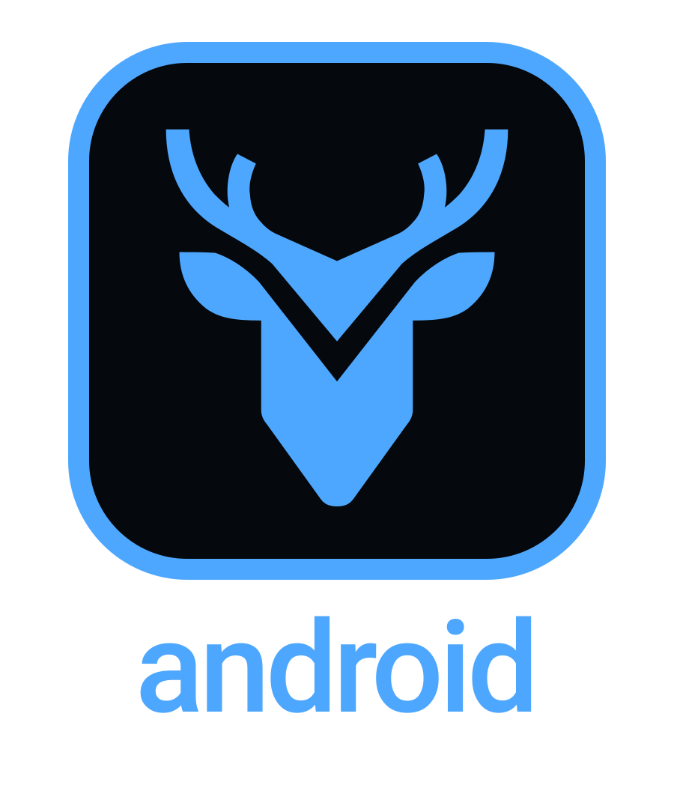

<div align="center">



# Gapwise for Android

### The native Android client for Gapwise.

**A privacy-first Kotlin + Jetpack Compose app for understanding your timetable, the time between classes, and the rest of your day.**

[](https://developer.android.com/)
[](https://kotlinlang.org/)
[](https://developer.android.com/compose)
[](LICENSE)

<sub>Kotlin · Jetpack Compose · Material 3 · MapLibre · Supabase · Android Keystore</sub>

<br />

**[Gapwise](https://gapwise.ca)** · **[AI](https://ai.gapwise.ca)** · **[Data](https://data.gapwise.ca)** · **[Docs](https://docs.gapwise.ca)** · **[Status](https://status.gapwise.ca)**

</div>

---

## What Gapwise for Android is

Gapwise for Android is the native Android client for **Gapwise**.

It brings the core Gapwise experience to a phone-native interface: timetable import, Today, timetable views, gap planning, map tools, account continuity, encrypted sync, appearance settings, and privacy-first local storage.

The app is built as a real Android application rather than a WebView wrapper. Navigation, storage, authentication, rendering, interactions, and platform integration are implemented with native Android technologies while staying aligned with the wider Gapwise product.

---

## Product direction

The Android app is designed around a few principles:

- **Fast to open and easy to understand.** The important parts of the day should be immediately visible.
- **Native interaction.** Android navigation, gestures, system pickers, theming, and lifecycle behavior should feel natural on-device.
- **Local-first timetable handling.** Imported calendar data is parsed on-device and the normalized timetable can remain available without repeated imports.
- **Optional account continuity.** Users can keep using Gapwise without an account, while signed-in users can opt into encrypted sync.
- **Deterministic planning.** Timetable arithmetic, gap boundaries, route timing, and other core calculations should remain explicit and testable.
- **Visual consistency.** The app should remain recognizably Gapwise while adapting the experience to a native Android surface.

---

## Current app surface

The native app currently includes:

- **Today** for the current day's schedule and immediate context;
- **Timetable** for imported ACORN calendar data;
- **Gaps** for time-between-class planning;
- **Map** for interactive location tools;
- **More / Settings** for appearance, account, sync, timetable, routing, planning, privacy, exports, and integrations;
- light and dark themes;
- local encrypted timetable persistence;
- optional encrypted Gapwise account sync;
- Google, Microsoft, and GitHub sign-in through the existing Gapwise account system.

The app is still under active development. Native behavior and visual parity with the web product will continue to improve over time.

---

## Architecture

Gapwise for Android uses modern native Android tooling:

- **Kotlin**
- **Jetpack Compose**
- **Material 3**
- **Navigation Compose**
- **Coroutines**
- **MapLibre Native**
- **Android Keystore**
- **Supabase Auth + encrypted Gapwise sync**

The project keeps domain logic, persistence, account/sync code, navigation, and feature UI separated so behavior can evolve without turning the app into one tightly coupled surface.

```text
app/src/main/java/ca/gapwise/android/
├── core/
│   ├── designsystem/
│   ├── model/
│   └── persistence/
├── data/
│   ├── account/
│   ├── sync/
│   └── timetable/
├── feature/
│   ├── today/
│   ├── timetable/
│   ├── gapplan/
│   ├── map/
│   └── settings/
└── navigation/
```

---

## Privacy and security

The Android client is designed around data minimization and clear trust boundaries.

Key properties include:

- ACORN `.ics` files are parsed locally;
- the original calendar file is not uploaded merely to build the timetable;
- normalized timetable data can be stored in app-private encrypted storage;
- local encryption uses Android Keystore-backed keys;
- authentication session material is stored encrypted on-device;
- account sync is optional;
- private sync payloads are encrypted before cloud storage;
- the app embeds only browser/client-safe public configuration, never privileged service credentials.

Gapwise does not treat an account as a prerequisite for the core timetable experience.

---

## Local development

Open the repository in Android Studio and use the Gradle wrapper with JDK 17.

```bash
git clone https://github.com/Gapwise-for-UTM/android.git
cd android
```

The project currently targets modern Android SDKs and is intended to be tested with both an emulator and a physical device before release.

For OAuth sign-in, the Gapwise Supabase project must allow the Android callback URI:

```text
gapwise://auth-callback
```

---

## Gapwise ecosystem

| Repository | Role | Primary surface |
| --- | --- | --- |
| **[`gapwise`](https://github.com/Gapwise-for-UTM/gapwise)** | Core web/PWA product and canonical Gapwise platform | [gapwise.ca](https://gapwise.ca) |
| **[`android`](https://github.com/Gapwise-for-UTM/android)** | Native Android client | Android app |
| **[`gapwise-ai`](https://github.com/Gapwise-for-UTM/gapwise-ai)** | Permissioned AI and MCP integration layer | [ai.gapwise.ca](https://ai.gapwise.ca) |
| **[`gapwise-data`](https://github.com/Gapwise-for-UTM/gapwise-data)** | Open data, provenance, schema, and validation | [data.gapwise.ca](https://data.gapwise.ca) |
| **[`gapwise-docs`](https://github.com/Gapwise-for-UTM/gapwise-docs)** | Canonical developer documentation | [docs.gapwise.ca](https://docs.gapwise.ca) |
| **[`gapwise-status`](https://github.com/Gapwise-for-UTM/gapwise-status)** | Independent service-health monitoring and incident communication | [status.gapwise.ca](https://status.gapwise.ca) |

---

## Independent project

> **Gapwise is an independent student software project created by Andrew Muratov. It is not affiliated with, endorsed by, or an official service of the University of Toronto.**

## License

Original project code and documentation are available under the [MIT License](LICENSE).

<div align="center">

**Built for the spaces between classes — now native on Android.**

[Open Gapwise →](https://gapwise.ca)

</div>
